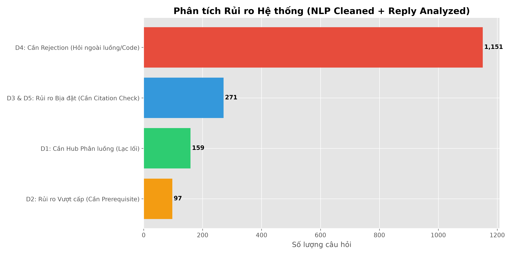

# 📊 Báo cáo Dữ liệu: Căn cứ thiết kế Kiến trúc Hub & Spoke và Benchmark
*(Sử dụng Thuật toán NLP Cleaning + Đối chiếu chéo Câu trả lời `tutor_reply` + Ràng buộc Ngữ cảnh Tiến độ)*

### 🚨 D4: Cần Rejection (Hỏi ngoài luồng/Code): 1,151 Lượt hỏi rủi ro
*Bằng chứng thực tế (Đã clean tiền tố UI) và Giải thích của Thuật toán:*
> **VD 1:** "” của buổi này) bạn dùng model gpt nào để sinh câu trả lời cho tôi"
> 💡 **Giải thích:** Phát hiện Bot cũ đã từ chối trả lời (Nằm ngoài phạm vi/Lỗi)
>

> **VD 2:** "thế m giới thiệu về web vlearn"
> 💡 **Giải thích:** Phát hiện Bot cũ đã từ chối trả lời (Nằm ngoài phạm vi/Lỗi)
>

> **VD 3:** "người trong ảnh là ai"
> 💡 **Giải thích:** Phát hiện Bot cũ đã từ chối trả lời (Nằm ngoài phạm vi/Lỗi)
>

> **VD 4:** "Product thinking"
> 💡 **Giải thích:** Phát hiện Bot cũ đã từ chối trả lời (Nằm ngoài phạm vi/Lỗi)
>

> **VD 5:** "Phân tích nội dung cơ bản của cả slide đang activate ?"
> 💡 **Giải thích:** Phát hiện Bot cũ đã từ chối trả lời (Nằm ngoài phạm vi/Lỗi)
>

### 🚨 D3 & D5: Rủi ro Bịa đặt (Cần Citation Check): 271 Lượt hỏi rủi ro
*Bằng chứng thực tế (Đã clean tiền tố UI) và Giải thích của Thuật toán:*
> **VD 1:** "CDC log-based khác biệt như thế nào so với phương pháp polling truyền thống về mặt hiệu năng và tác động lên hệ thống nguồn?"
> 💡 **Giải thích:** Yêu cầu đối soát ngặt nghèo qua từ khóa: 'khác biệt'
>

> **VD 2:** "Yêu cầu: Trong nghiên cứu mô hình chơi Othello, ghép quan sát với điều nó hỗ trợ trực tiếp nhất. Model dự đoán nước đi hợp lệ với độ chính xác cao:"
> 💡 **Giải thích:** Yêu cầu đối soát ngặt nghèo qua từ khóa: 'chính xác'
>

> **VD 3:** "” của buổi này) Tôi muốn so sánh đủ các tiêu chí cốt lõi"
> 💡 **Giải thích:** Yêu cầu đối soát ngặt nghèo qua từ khóa: 'so sánh'
>

> **VD 4:** "GRPO là gì? Group relative prolicy optimization. Lấy trung bình reward của nhóm G samples cho cùng prompt là baseline - thay thế cho value model trong PPO.  1 nhóm random thay đổi temp 8 lần rồi tính ..."
> 💡 **Giải thích:** Yêu cầu đối soát ngặt nghèo qua từ khóa: 'so sánh'
>

> **VD 5:** "CDC log-based khác biệt như thế nào so với phương pháp polling truyền thống về mặt hiệu năng và tác động lên hệ thống nguồn?"
> 💡 **Giải thích:** Yêu cầu đối soát ngặt nghèo qua từ khóa: 'khác biệt'
>

### 🚨 D1: Cần Hub Phân luồng (Lạc lối): 159 Lượt hỏi rủi ro
*Bằng chứng thực tế (Đã clean tiền tố UI) và Giải thích của Thuật toán:*
> **VD 1:** "https://github.com/hoangcongchu2k4-ctrl/K4-DAY01-HoangCongChu-[MSSV]/tree/main/report nộp link này là được à"
> 💡 **Giải thích:** Câu hỏi chứa từ khóa lạc lối/tìm đường: 'link'
>

> **VD 2:** "” của buổi này) Tôi có thể tìm hiểu thêm về thiết kế AI ở đâu trong bài này?"
> 💡 **Giải thích:** Câu hỏi chứa từ khóa lạc lối/tìm đường: 'ở đâu'
>

> **VD 3:** "Làm sao để tìm thấy link repo trên tài liệu khoá học?"
> 💡 **Giải thích:** Câu hỏi chứa từ khóa lạc lối/tìm đường: 'link'
>

> **VD 4:** "” của buổi này) cho tôi link trong slide dang mở"
> 💡 **Giải thích:** Câu hỏi chứa từ khóa lạc lối/tìm đường: 'link'
>

> **VD 5:** "Nộp links repo Lab 1 ở đâu ?"
> 💡 **Giải thích:** Câu hỏi chứa từ khóa lạc lối/tìm đường: 'link'
>

### 🚨 D2: Rủi ro Vượt cấp (Cần Prerequisite): 97 Lượt hỏi rủi ro
*Bằng chứng thực tế (Đã clean tiền tố UI) và Giải thích của Thuật toán:*
> **VD 1:** "vậy trong hệ thống RAG, ngoài chunking và embedding thì còn kỹ thuật nào nữa"
> 💡 **Giải thích:** Hỏi về 'rag' khi đang ở Day 4 (Chưa học tới Day 7)
>

> **VD 2:** "Agent khác LLM ở điểm nào?"
> 💡 **Giải thích:** Hỏi về 'agent' khi đang ở Day 1 (Chưa học tới Day 3)
>

> **VD 3:** "tại sao lại cần quan tâm đến agent làm việc như nào thay vì quan tâm đến kết quat"
> 💡 **Giải thích:** Hỏi về 'agent' khi đang ở Day 1 (Chưa học tới Day 3)
>

> **VD 4:** "Hiện tại các Vector DB hiện đại đã có ANN ?"
> 💡 **Giải thích:** Hỏi về 'vector' khi đang ở Day 4 (Chưa học tới Day 7)
>

> **VD 5:** "tức là worker là một agent à"
> 💡 **Giải thích:** Hỏi về 'agent' khi đang ở Day 2 (Chưa học tới Day 3)
>

